# 🩸 LifelineDB - A Blood Bank Management System -- Oracle SQL + PHP + JS + HTML + CSS

A **Blood Bank Management System** that allows users to register donors and patients, record blood donations, request blood units, and manage inventory — all powered by **Oracle SQL procedures**, **PHP backend**, and a **dynamic HTML+CSS+JavaScript frontend**.

> **Built for educational and demonstration purposes**, prototype for DataBase Management System lab projects or college mini-projects.

---

## ✨ Key Features

- ✅ Register new donors and patients
- 💉 Record blood donations with volume and blood group
- 🩸 Request blood units and auto-update inventory
- 📋 View donors, requests, inventory summaries
- 🎯 Reward points system for donors
- 🔎 Find donors by blood group
- 🔁 Unified dynamic form handler using PL/SQL procedures
- 📦 Full Oracle DB integration with `oci_connect` in PHP

---

## 🛠️ Technologies Used

| Layer         | Tech                            |
|---------------|----------------------------------|
| 💾 Backend     | PHP 8.x + OCI for Oracle DB      |
| 📊 Database    | Oracle 11g/12c/21c with PL/SQL   |
| 🖥️ Frontend    | HTML5, CSS3, JavaScript (Vanilla)|
| 📦 Stack       | XAMPP + Oracle XE                |

---

## 📸 Screenshots

| Description            | Screenshot |
|------------------------|------------|
| 0️⃣ Homepage             | 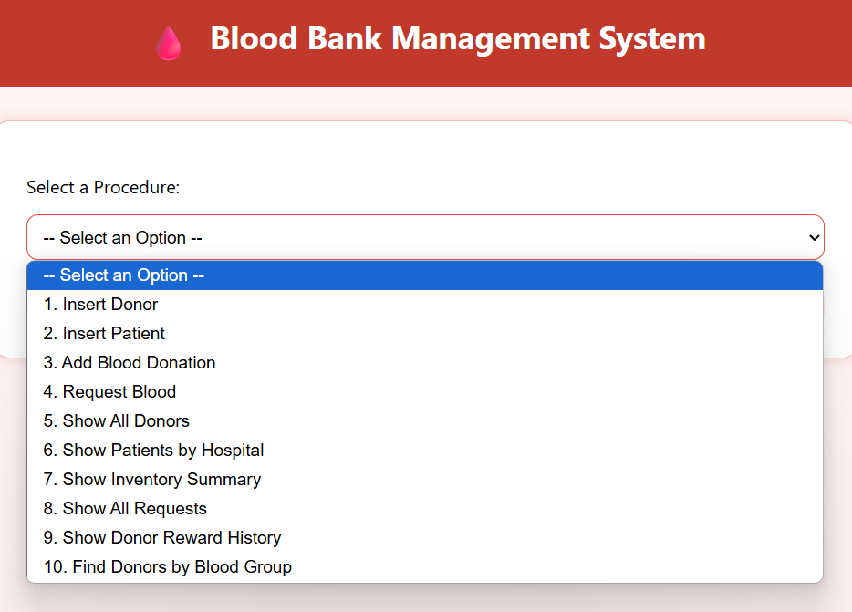 |
| 1️⃣ Insert Donor         | 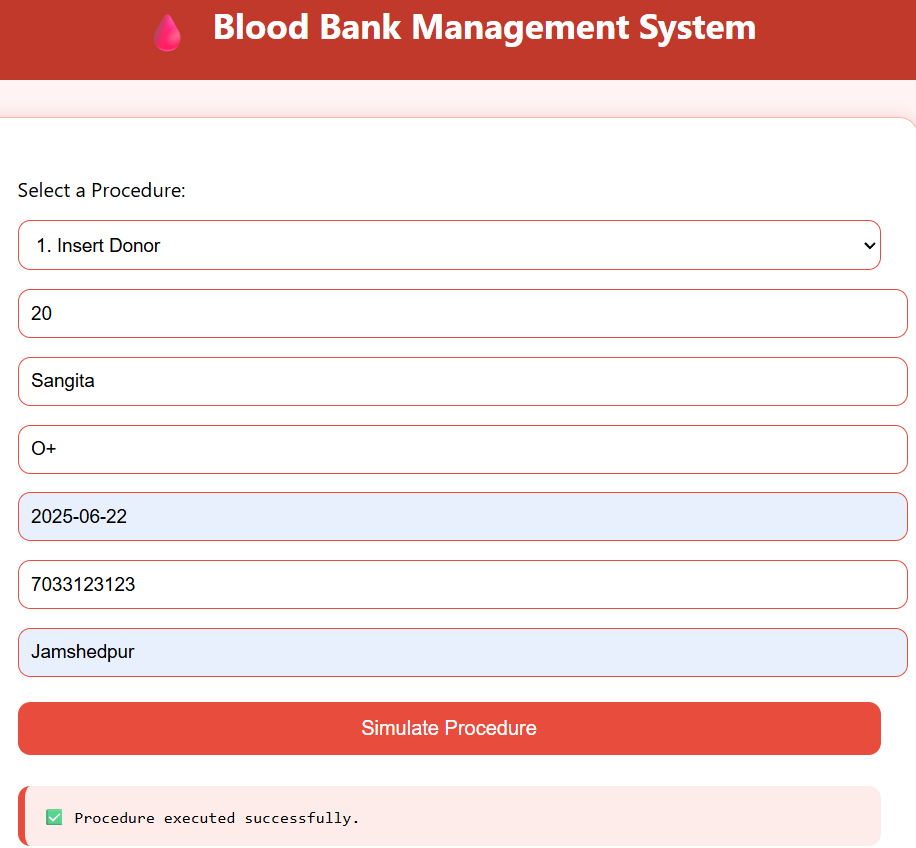 |
| 2️⃣ Insert Patient         | 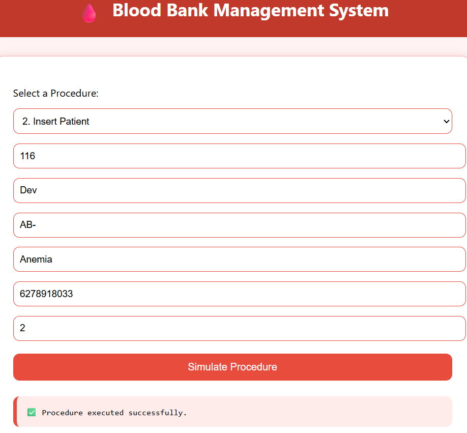 |
| 3️⃣ Add Blood Donation         | 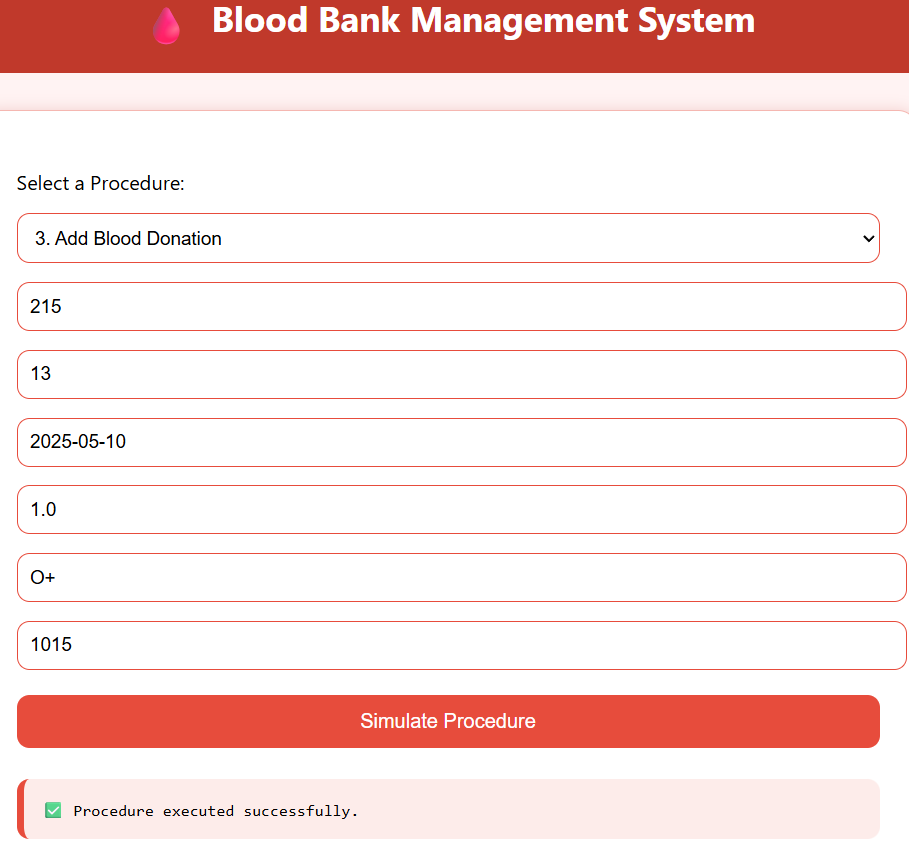 |
| 4️⃣ Request Blood         | 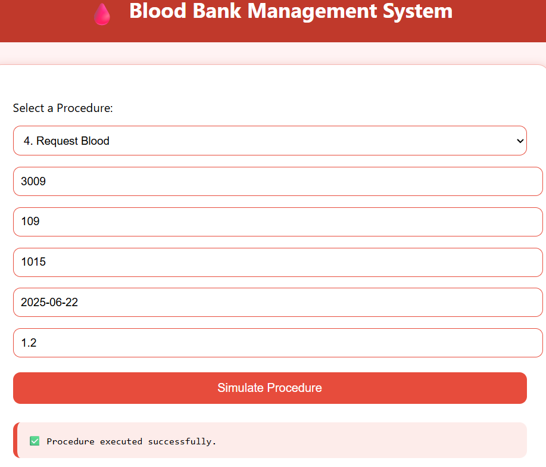 |
| 5️⃣ Show All Donors         | 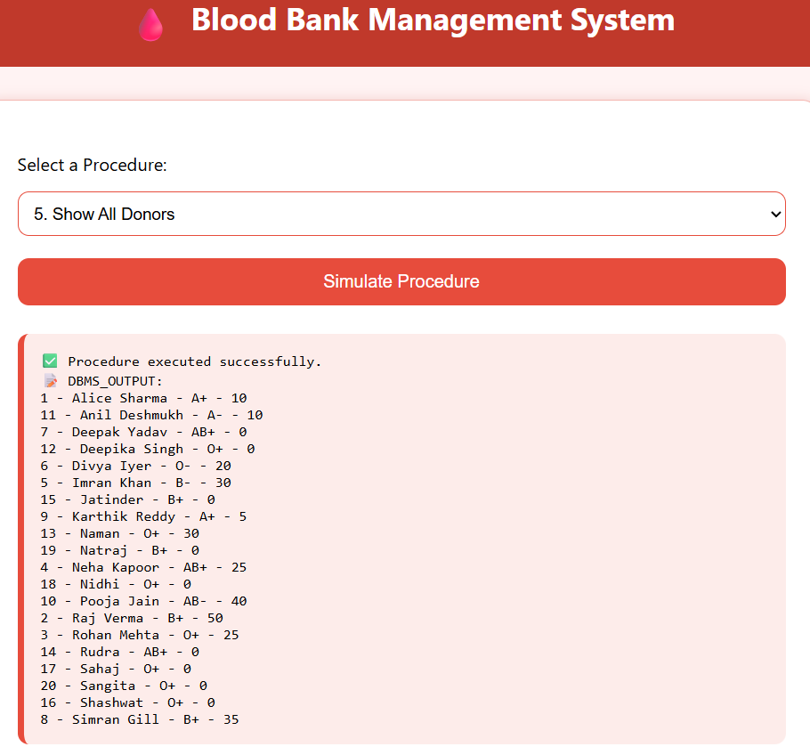 |
| 6️⃣ Show Patients by Hospital         | 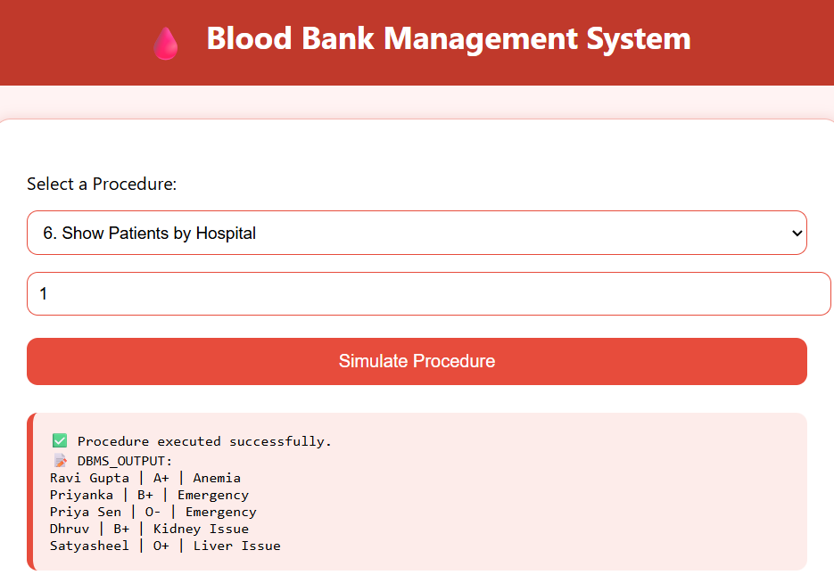 |
| 7️⃣ Show Inventory Summary         | 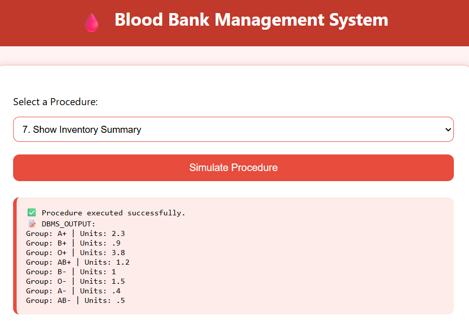 |
| 8️⃣ Show All Requests         | 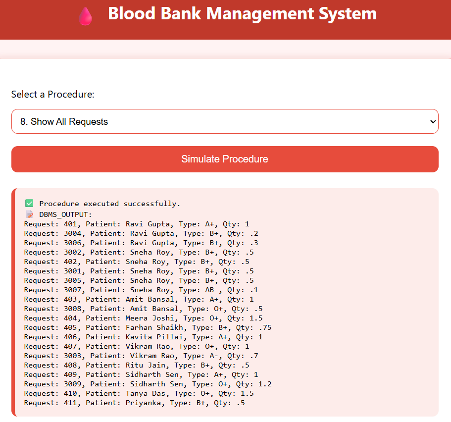 |
| 9️⃣ Show Donor Reward History         | 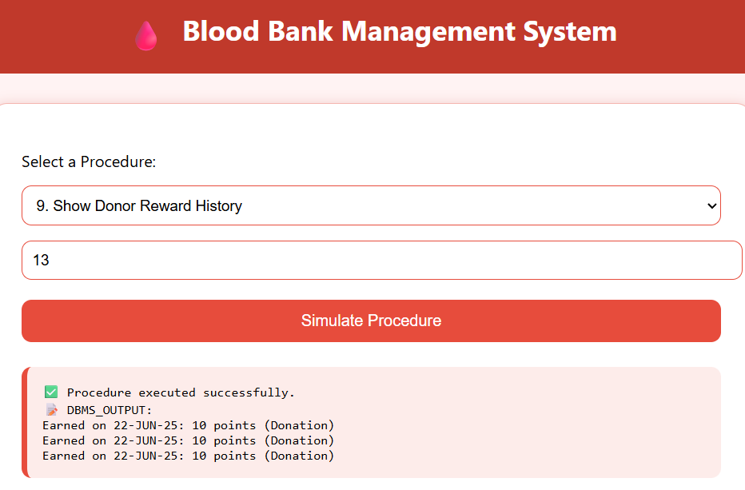 |
| 🔟 Find Donors by Blood Group   | 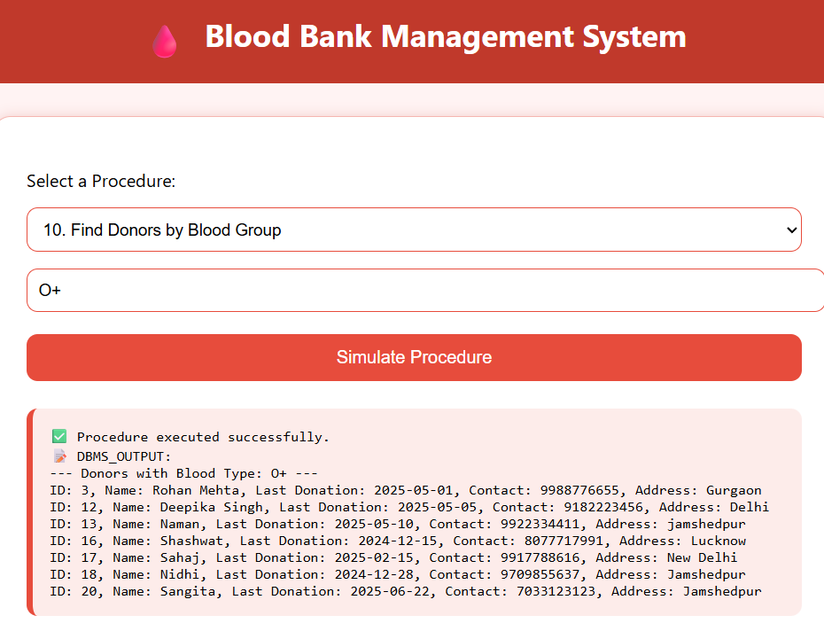 |


---

## 🎥 Demo Video

Watch the full working demo of the project:

👉 [Watch Demo Video](https://drive.google.com/file/d/1_UeDFNqDwnQsgyTAM6ka0uqom2HrIZl9/view?usp=sharing)


---

## 📁 Project Structure

```text
LifelineDB--A-Blood-Bank-Management-System/
│
├── demo/                       # 🎥 Demo video folder
│   └── Demo.mp4
│
├── screenshots/                # 🖼️ Screenshots folder
│   ├── 0(homepage).png
│   ├── 1.png
│   └── ... up to 10.png
│
├── Blood_Bank_Schema.sql       # 📄 Oracle DB schema + procedures
├── index.html                  # 🌐 Main UI interface
├── styles.css                  # 🎨 Styling for the interface
├── script.js                   # ⚙️ JavaScript logic for frontend
└── execute_procedure.php       # 🧠 PHP backend with PL/SQL bridge
```

---

## 🚀 Setup Instructions

### 🔧 Step 1: Clone or Download

```bash
git clone https://github.com/GithubNaman259/LifelineDB--A-Blood-Bank-Management-System.git
```

### 🔧 Step 2: Oracle DB Setup

- Open Oracle SQL Developer
- Connect to your XE database as SYSTEM
- Open Blood_Bank_Schema.sql
- Run the file to create all tables and procedures

### 🔧 Step 3: XAMPP Setup

- Copy the entire project folder to:
  ```text
  C:/xampp/htdocs/LifelineDB--A-Blood-Bank-Management-System
  ```
  
- Enable the following extension in your **php.ini** file:
  ```text
  php_oci8_12c.dll
  ```
  
- Restart Apache from your XAMPP control panel


### 🔧 Step 4: Run Project

- Open your browser and go to:
  ```text
  http://localhost/LifelineDB--A-Blood-Bank-Management-System/index.html
  ```

- Use the dropdown menu on the interface to simulate and visualize different PL/SQL procedures!

---

## 🙏 Acknowledgements

- SQL Schema and PL/SQL Procedures: Designed and implemented by ME (Naman Kumar).

- Frontend Interface, PHP Integration & XAMPP Configuration: Developed with assistance from Teammates.
